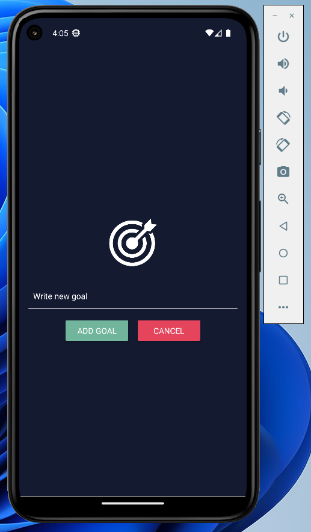

# Goals-App 🎯

Nice implementation of goals mobile app.

The purpose of this project is to learn well the basics of the React Native.



## Technologies

👉 REACT Native

## Implementation Remarks

1️⃣ I have added to the project 3 main components that will help me perform the task in a simpler:
1. App - The main component of the project.
2. GoalItem - Contains the goal content and her style.
3. GoalInput - Contains the input field and the submit button and her styles.

## Usage

```
~$: npm i
~$: npm start
```

🔹 To execute in Andriod studio environemt:

```
~$: a
```
🔹 To execute in web-browser:
```
~$: w
```

## for any questions

```
if(haveAnyQuestions === true){
    let yourName = ".......", question = ".......";
    sendEmailToMe(yourName,question,odedatias8115@gmail.com);
}
```
